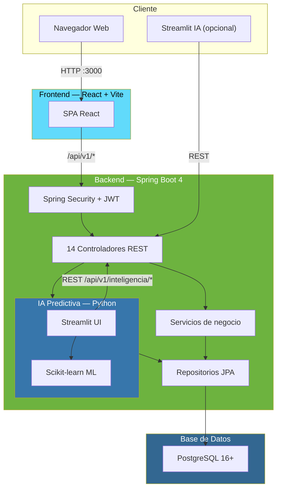
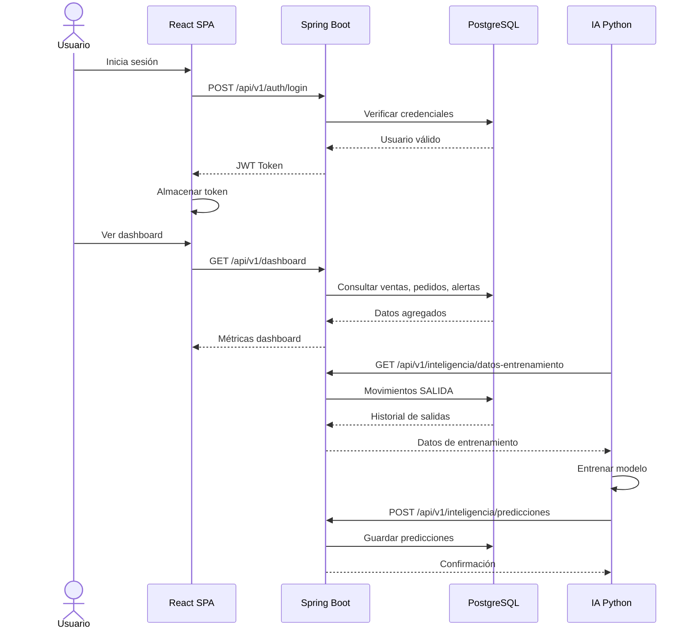

# Arquitectura del sistema

## Diagrama de componentes



## Flujo de datos



## Estructura del proyecto

```
sgip-backend/
├── src/main/java/com/metroica/sgip_backend/
│   ├── alertas/          # Alertas de stock y predictivas
│   ├── config/           # Seguridad, JWT, rate limiting, WebConfig
│   ├── dashboard/        # Métricas del dashboard
│   ├── inteligencia/     # Servicio IA, predicciones, datos entrenamiento
│   ├── movimientos/      # Movimientos de inventario (entrada/salida)
│   ├── notificaciones/   # Notificaciones internas y email
│   ├── pedidos/          # Gestión de pedidos, cola, estados
│   ├── productos/        # Productos, categorías, proveedores
│   ├── reportes/         # PDF y Excel de inventario y pedidos
│   ├── seguridad/        # Auth, JWT, usuarios, roles
│   └── shared/           # Enums, excepciones, utils
├── src/main/resources/
│   ├── application.properties       # Configuración base
│   └── application-prod.properties  # Perfil productivo
├── src/test/             # Pruebas unitarias, integración, BDD, Selenium, JMeter
├── frontend/             # React 19 + Vite SPA
├── ia_prediccion.py      # Streamlit + modelo IA
├── Adicionales/          # Scripts SQL para despliegue
├── documentacion/        # Evidencia académica y casos de prueba
├── scripts/              # Scripts de arranque y despliegue
└── docs/                 # Documentación MkDocs (este sitio)
```

## Patrones de diseño utilizados

| Patrón | Aplicación |
|---|---|
| **MVC** | Controladores REST (`@RestController`) → Servicios (`@Service`) → Repositorios (`@Repository`) |
| **DAO / Repository** | Spring Data JPA con interfaces `JpaRepository` |
| **DTO** | Objetos de transferencia entre capas (request/response) |
| **Singleton** | Beans de Spring por defecto |
| **Factory Method** | `@Bean` en configuraciones, `ProductoMapper` |
| **Proxy** | Hibernate lazy loading, Spring AOP para transacciones |
| **Observer** | Sistema de notificaciones y alertas |
| **Strategy** | Rate limiting por tipo de endpoint, generación de reportes PDF/Excel |
| **Chain of Responsibility** | Filtros de seguridad (JWT → autenticación → autorización) |
