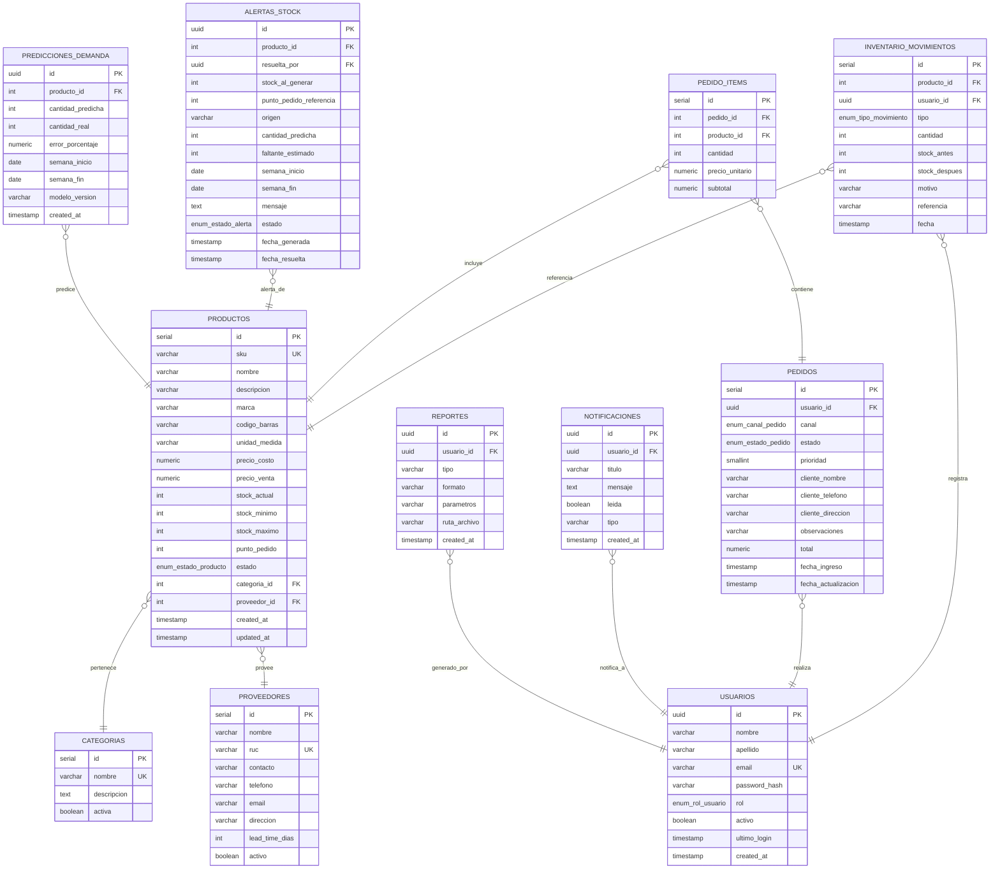

# Base de Datos

SGIP utiliza **PostgreSQL 16+** con un esquema relacional gestionado por Hibernate (`ddl-auto=validate`).

---

## Esquema entidad-relación



---

## Enums

### `rol_usuario`

| Valor |
|---|
| `ADMINISTRADOR` |
| `GERENTE` |
| `OPERARIO` |

### `estado_producto`

| Valor |
|---|
| `ACTIVO` |
| `INACTIVO` |
| `AGOTADO` |

### `tipo_movimiento`

| Valor |
|---|
| `ENTRADA` |
| `SALIDA` |

### `canal_pedido`

| Valor |
|---|
| `LOCAL` |
| `DELIVERY` |

### `estado_pedido`

| Valor |
|---|
| `PENDIENTE` |
| `EN_PROCESO` |
| `LISTO` |
| `DESPACHADO` |
| `CANCELADO` |

### `estado_alerta`

| Valor |
|---|
| `ACTIVA` |
| `RESUELTA` |

---

## Índices principales

| Tabla | Columna(s) | Tipo |
|---|---|---|
| `productos` | `sku` | Único |
| `productos` | `categoria_id` | FK |
| `productos` | `proveedor_id` | FK |
| `inventario_movimientos` | `producto_id` | FK |
| `inventario_movimientos` | `fecha` | B-tree (consultas por rango) |
| `pedidos` | `fecha_ingreso` | B-tree |
| `pedidos` | `estado` | B-tree |
| `alertas_stock` | `producto_id`, `estado` | Compuesto |
| `predicciones_demanda` | `producto_id`, `semana_inicio` | Compuesto |
| `notificaciones` | `usuario_id`, `leida` | Compuesto |

---

## Carga inicial del esquema

El esquema se crea ejecutando el script SQL:

```bash
psql -d metroDB -f Adicionales/metro_esquema_clean.sql
```

Este script define tipos enum, tablas, claves primarias, claves foráneas, índices y restricciones.

---

## DDL auto

En todos los perfiles se usa `spring.jpa.hibernate.ddl-auto=validate`:

- Hibernate **no crea ni modifica** el esquema.
- Verifica que las entidades JPA coincidan con las tablas existentes.
- Si hay discrepancia, la aplicación **no arranca** y muestra el error.
- Esto garantiza que el esquema de producción no se altera accidentalmente.

---

## Migraciones

Las migraciones entre versiones se aplican manualmente con scripts SQL en `Adicionales/`:

| Versión | Script |
|---|---|
| v2 → v3 | `migracion_v2.sql` |
| v3 → v4 | `migracion_v3_alertas_predictivas.sql` |
