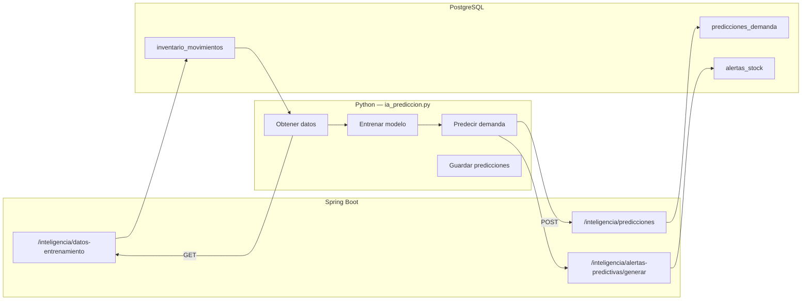

# IA Predictiva

SGIP integra un módulo de inteligencia artificial que predice la demanda semanal de productos basándose en el historial de movimientos de salida. El modelo se entrena con scikit-learn y se expone mediante una interfaz Streamlit.

---

## Arquitectura del módulo IA



---

## Funcionamiento

### 1. Extracción de datos de entrenamiento

El endpoint `GET /api/v1/inteligencia/datos-entrenamiento` devuelve todos los movimientos de tipo `SALIDA` con los siguientes campos:

| Campo | Descripción |
|---|---|
| `productoId` | ID del producto |
| `sku` | Código SKU |
| `nombre` | Nombre del producto |
| `categoria` | Categoría del producto |
| `cantidad` | Unidades vendidas |
| `fecha` | Fecha y hora del movimiento |

### 2. Entrenamiento del modelo

La IA de Streamlit:

1. Recibe los datos históricos desde el backend.
2. Agrupa las salidas por producto y semana.
3. Entrena un modelo de regresión (RandomForest o LinearRegression de scikit-learn) con las últimas N semanas.
4. El modelo aprende patrones de demanda por producto.

### 3. Generación de predicciones

1. Para cada producto activo, el modelo predice la demanda para la próxima semana.
2. Las predicciones se envían al backend mediante `POST` al endpoint de predicciones.
3. El backend persiste las predicciones en la tabla `predicciones_demanda`.

### 4. Cálculo de precisión

Cuando una semana pronosticada termina:

1. El backend compara la cantidad predicha con la cantidad real (suma de salidas de esa semana).
2. Calcula el error porcentual: `|real - predicha| / predicha * 100`.
3. La precisión se muestra en el dashboard como porcentaje de acierto promedio.

Si ya existen `cantidad_real` y `error_porcentaje` en la base de datos (por ejemplo, cargados con el dataset de preproducción), el dashboard los muestra sin esperar al cierre de la semana.

### 5. Alertas predictivas

El sistema genera alertas cuando:

- La demanda predicha supera el stock actual del producto.
- Se estima un faltante para la semana pronosticada.
- El stock quedaría cerca o por debajo del punto de pedido.

Las alertas incluyen:

- Producto afectado.
- Stock actual.
- Demanda predicha.
- Faltante estimado.
- Semana de inicio y fin de la predicción.

---

## Interfaz Streamlit

La UI de Streamlit permite:

- Visualizar los datos de entrenamiento.
- Entrenar el modelo manualmente.
- Ver las predicciones generadas.
- Consultar la precisión histórica.
- Generar y enviar predicciones al backend.
- Ejecutar en modo local (sin autenticación) o producción (con JWT).

---

## Configuración

### Modo local

```bash
streamlit run ia_prediccion.py
```

No requiere autenticación. Ideal para desarrollo y pruebas.

### Modo producción

```bash
IA_ENV=prod \
IA_API_URL=https://dominio-cliente/api/v1/inteligencia/datos-entrenamiento \
IA_API_TOKEN=eyJhbGciOi... \
streamlit run ia_prediccion.py
```

En modo producción, la IA se autentica con un token JWT de un usuario `ADMINISTRADOR` o `GERENTE`. El token se obtiene mediante `POST /api/v1/auth/login`.

### Variables de entorno

| Variable | Descripción |
|---|---|
| `IA_ENV` | `local` o `prod` |
| `IA_API_URL` | URL de datos de entrenamiento |
| `IA_PREDICCIONES_URL` | URL de predicciones |
| `IA_LOGIN_URL` | URL de login |
| `IA_API_TOKEN` | Token JWT (alternativa a email/password) |
| `IA_API_EMAIL` | Email para login automático |
| `IA_API_PASSWORD` | Contraseña para login automático |

---

## Requisitos de datos

Para que la IA funcione correctamente se necesitan:

- Al menos **2 semanas** de datos históricos por producto.
- Movimientos de tipo `SALIDA` registrados en `inventario_movimientos`.
- Productos activos con SKU definido.

---

## Dataset de preproducción

Para demostraciones y sustentaciones, se proporciona un dataset controlado que simula 12 semanas de operación:

- 41 productos con SKU `PREPROD-*`.
- 492 movimientos de salida.
- 41 predicciones históricas cerradas.
- Precisión promedio simulada: ~94%.

Ver los archivos `Adicionales/dataset_preproduccion_*.sql` y su documentación asociada.
