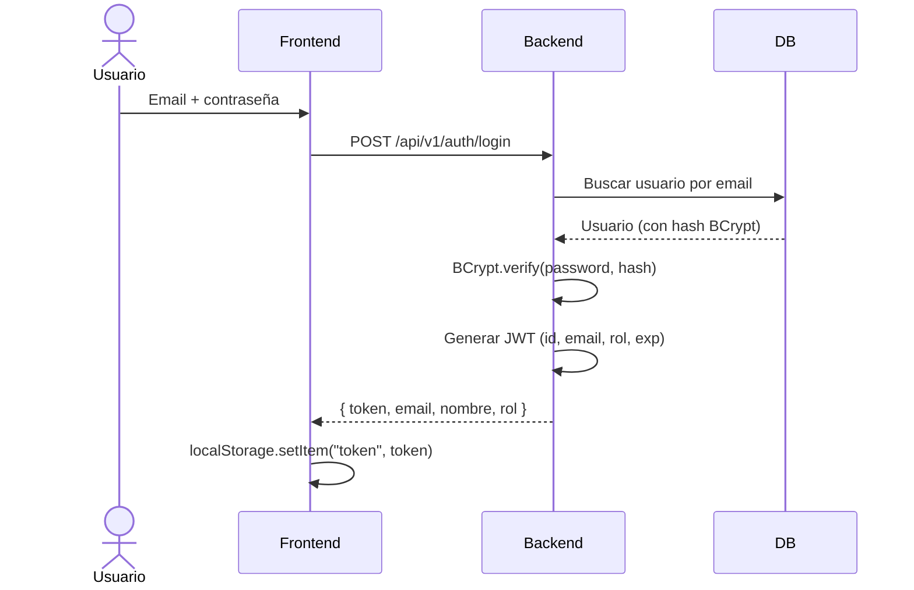

# Seguridad

SGIP implementa seguridad en capas combinando autenticación JWT, autorización por roles, cifrado de contraseñas con BCrypt y rate limiting.

---

## Autenticación

### Flujo de login



### JWT (JSON Web Token)

- **Algoritmo**: HMAC-SHA256 (JJWT 0.12).
- **Claims incluidos**: `sub` (ID), `email`, `rol`.
- **Expiración**: configurable con `JWT_EXPIRATION` (default: 1 hora en prod).
- **Secreto**: configurable con `JWT_SECRET` (mínimo 32 caracteres).
- El secreto de desarrollo NO debe usarse en producción.

### Renovación

El frontend detecta respuestas `401` y redirige automáticamente al login. El token se almacena en `localStorage` y se envía en cada petición como:

```http
Authorization: Bearer eyJhbGciOi...
```

---

## Autorización

### Jerarquía de roles

```
ADMINISTRADOR > GERENTE > OPERARIO
```

### Endpoints protegidos

| Endpoint | ADMINISTRADOR | GERENTE | OPERARIO |
|---|---|---|---|
| `/api/v1/auth/login` | :white_check_mark: | :white_check_mark: | :white_check_mark: |
| `/api/v1/auth/register` | :white_check_mark: | :x: | :x: |
| `/api/v1/usuarios/**` | :white_check_mark: | :x: | :x: |
| `/api/v1/productos` GET | :white_check_mark: | :white_check_mark: | :white_check_mark: |
| `/api/v1/productos` POST/PUT/DELETE | :white_check_mark: | :x: | :x: |
| `/api/v1/categorias` GET | :white_check_mark: | :white_check_mark: | :white_check_mark: |
| `/api/v1/proveedores` GET | :white_check_mark: | :white_check_mark: | :white_check_mark: |
| `/api/v1/proveedores` POST/PUT/DELETE | :white_check_mark: | :x: | :x: |
| `/api/v1/movimientos/**` | :white_check_mark: | :x: | :white_check_mark: |
| `/api/v1/pedidos/**` | :white_check_mark: | :x: | :white_check_mark: |
| `/api/v1/pedidos/cola` GET | :white_check_mark: | :white_check_mark: | :white_check_mark: |
| `/api/v1/alertas` GET | :white_check_mark: | :white_check_mark: | :white_check_mark: |
| `/api/v1/alertas` PATCH | :white_check_mark: | :x: | :x: |
| `/api/v1/dashboard/**` | :white_check_mark: | :white_check_mark: | :x: |
| `/api/v1/inteligencia/**` | :white_check_mark: | :white_check_mark: | :x: |
| `/api/v1/reportes/**` | :white_check_mark: | :white_check_mark: | :x: |
| `/api/v1/notificaciones/**` | :white_check_mark: | :white_check_mark: | :white_check_mark: |

### Doble capa de autorización

1. **SecurityConfig**: reglas declarativas por URL pattern y método HTTP.
2. **`@PreAuthorize`**: anotaciones en métodos específicos para validaciones adicionales.

---

## Cifrado de contraseñas

- **Algoritmo**: BCrypt (Spring Security `BCryptPasswordEncoder`).
- Las contraseñas nunca se almacenan en texto plano.
- El hash BCrypt incluye salt automático.
- Los usuarios demo usan contraseñas documentadas solo para desarrollo local.

---

## Rate Limiting

Implementado con Bucket4j para proteger contra abusos:

| Endpoint | Método | Límite |
|---|---|---|
| Login | `POST` | 10 req/min |
| Pedidos | `POST` | 30 req/min |
| Movimientos | `POST` | 60 req/min |
| Reportes | `GET` | 20 req/min |
| IA (alertas) | `POST` | 10 req/min |
| IA (datos) | `GET` | 30 req/min |
| General | Todos | 100 req/min |

La identificación se hace por:

- **Token JWT**: `jwt:<hash>` si la petición incluye `Authorization: Bearer`.
- **IP**: `ip:<remoteAddr>` para peticiones sin token.

Al exceder el límite, se responde `429 Too Many Requests`:

```json
{"error": "Demasiadas solicitudes. Intente de nuevo en unos segundos."}
```

---

## Protección contra amenazas comunes

| Amenaza | Protección |
|---|---|
| **CSRF** | Deshabilitado (API stateless con JWT) |
| **XSS** | React escapa por defecto; Content-Type: application/json |
| **SQL Injection** | JPA/Hibernate con parámetros bindeados |
| **Fuerza bruta** | Rate limiting en login (10 req/min) |
| **Sesiones fijadas** | Sin sesiones de servidor (stateless JWT) |
| **Exposición de datos** | `@JsonProperty(access = WRITE_ONLY)` en password hash |
| **Acceso a archivos** | Validación de ruta en descarga de reportes (no escapa del directorio base) |

---

## Configuración de seguridad en producción

```bash
# Generar secreto JWT seguro (mín. 32 caracteres)
openssl rand -base64 48

# El secreto va en .env (no en el repositorio)
JWT_SECRET=generado_por_openssl

# El hash BCrypt del primer admin se genera fuera del repositorio
# y se pasa como variable al script SQL
```

---

## Variables de entorno de seguridad

| Variable | Obligatoria en prod | Descripción |
|---|---|---|
| `JWT_SECRET` | Sí | Secreto para firmar tokens |
| `JWT_EXPIRATION` | No | Duración del token (default: 3600000 ms) |
